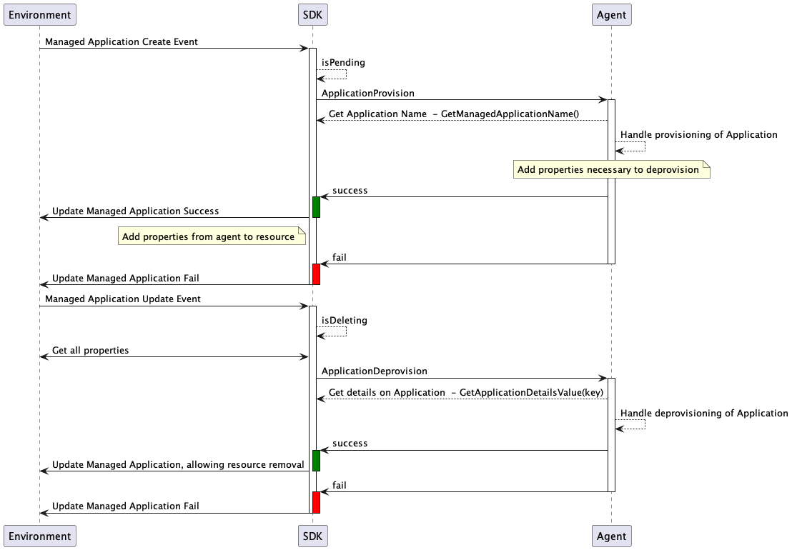

# Provisioning Setup and Processing

## Table of Contents

- [Provisioning Setup and Processing](#provisioning-setup-and-processing)
  - [Table of Contents](#table-of-contents)
  - [Provisioning Resources and Schemas](#provisioning-resources-and-schemas)
    - [Creating Access Request Schemas](#creating-access-request-schemas)
    - [Creating Credential Request Schemas](#creating-credential-request-schemas)
    - [Schema Builder](#schema-builder)
    - [Schema Property Builder](#schema-property-builder)
      - [String Property Builder](#string-property-builder)
      - [Number Property Builder](#number-property-builder)
      - [Integer Property Builder](#integer-property-builder)
      - [Array Property Builder](#array-property-builder)
  - [Handle Provisioning Requests](#handle-provisioning-requests)
    - [Creating and Registering Provisioner](#creating-and-registering-provisioner)
      - [RequestStatus return structure](#requeststatus-return-structure)
    - [Application Request Provision and Deprovision](#application-request-provision-and-deprovision)
    - [Access Request Provision and Deprovision](#access-request-provision-and-deprovision)
    - [Credential Request Provision and Deprovision](#credential-request-provision-and-deprovision)

Marketplace Provisioning allows the consumer to create applications, associate products, and create credentials. Amplify Agents SDK watches for API server resources to trigger provisioning events for the agent to handle. The agents can configure data that is required from consumers to provision access or create credentials for the resource in the connected gateway.

## Provisioning Resources and Schemas

### Creating Access Request Schemas

An Access Request Definition tells Marketplace the information that a consumer may provide for granting access to a discovered API.

The Amplify Agent SDK provides a mechanism to set up access request definition schemas based on configuration parameters required by the connected gateway. The agent can set up schemas which register resources of type AccessRequestDefinition in Amplify Central. When the agent discovers an API and publishes it to Amplify Central, the created resource references one of the AccessRequestDefinition resources and associates it with the published API. This could be a schema per API on the target gateway or based on the authentication type of API.

The agent implementation can use the helper method `agent.NewAPIKeyAccessRequestBuilder().Register()` for an access request definition named *api-key* for API Key APIs that require no additional data for provisioning. It is also possible for the agent to create its own access request definitions by using `agent.NewAccessRequestBuilder()`, adding schema properties, see below, before calling Register.

Below is an example of using the builder to create a single Access Request Definition, named after an API. A single required property, Access Tier, with a list of accepted values. This could be called as part of the discovery process of an API, or at startup if its a single schema for many APIs.

```go
import (
    "github.com/Axway/agent-sdk/pkg/agent"
    "github.com/Axway/agent-sdk/pkg/apic/provisioning"
)

func createAccessRequestDefinition(apiName string, tiers []string) {
  agent.NewAccessRequestBuilder().
    SetName(apiName).
    AddProperty(provisioning.NewSchemaPropertyBuilder().
      SetName("tier").
      SetLabel("Access Tier").
      SetDescription("The Access Tier").
      SetRequired()).
      IsString().
        SetEnumValues(tiers).
        SetSortEnumValues()).
    Register()
}
```

### Creating Credential Request Schemas

A Credential Request Definition tells Marketplace the information that a consumer may provide for creating credentials required by a discovered API.

The Amplify Agent SDK provides a mechanism to set up credential request definition schemas based on configuration parameters required by the connected gateway. The agent can set up schemas which register resources of type CredentialRequestDefinition in Amplify Central. When the agent discovers an API and publishes it to Amplify Central, the created resource will then reference one or more of the CredentialRequestDefinition resources and associate them with the published API. Resulting in a list of all credential types that a particular API supports.

Along with the data needed to handle a provisioning request, the Credential Request Definition also contains a provisioning schema that defines the structure of the provisioned credential. For example an oauth credential will define a provisioning schema with a *client id* field and a *client secret* field that shall be encrypted.

The agent implementation provides a few helper methods for creating these Credential Requests Definitions, as described below.

```go
import (
    "github.com/Axway/agent-sdk/pkg/agent"
    "github.com/Axway/agent-sdk/pkg/apic/provisioning"
)

func createCredentialRequestDefinitions() {
  agent.NewAPIKeyCredentialRequestBuilder().Register() // API Key CRD builder with no additional settings 

  oAuthTypeProp := provisioning.NewSchemaPropertyBuilder(). // create a property for the Oauth credential type
    SetName("credType").
    SetRequired().
    SetDescription("Credential Type").
    IsString().
      SetEnumValues([]{"Public","Confidential"}) // add an enumeration

  agent.NewOAuthCredentialRequestBuilder(             // Oauth CRD builder helper, adds client id field
    agent.WithCRDOAuthSecret(),                       // its a secret based credential, add client secret field
    agent.WithCRDRequestSchemaProperty(oAuthTypeProp) // add a request schema property
  ).Register() 
    
  agent.NewOAuthCredentialRequestBuilder(              // Oauth CRD builder helper, adds client id field
    agent.WithCRDOAuthPublicKey(),                     // its a key based credential, add public key request property
    agent.WithCRDRequestSchemaProperty(oAuthTypeProp), // add a request schema property
  ).Register()
}
```

### Schema Builder

The schema builder has the following methods that may be used.

```go
type SchemaBuilder interface {
  // Set a name for the schema, this is required
  SetName(name string) SchemaBuilder

  // Set a description for the schema
  SetDescription(name string) SchemaBuilder

  // Add a property, via the SchemaPropertyBuilder, to the schema, call this as many times as needed
  AddProperty(property SchemaPropertyBuilder) SchemaBuilder

  // Add a unique key to the schema, call this as many times as needed
  AddUniqueKey(keyName string) SchemaBuilder

  // Builds the schema to be used, returns the json schema in a map[string]interface
  Build() (map[string]interface{}, error)
}
```

### Schema Property Builder

The schema property builder has the following methods that may be used. Once a type is selected, IsString(), IsInteger(), IsNumber(), IsObject(), IsArray(), additional type specific methods are available.

```go
type TypePropertyBuilder interface {
  // SetName - sets the name of the property
  SetName(name string) SubscriptionPropertyBuilder
  // SetLabel - sets the label for the property for UI display
  SetLabel(label string) TypePropertyBuilder
  // SetDescription - set the description of the property
  SetDescription(description string) SubscriptionPropertyBuilder
  // SetRequired - set the property as a required field in the schema
  SetRequired() SubscriptionPropertyBuilder
  // SetReadOnly - set the property as a read only property
  SetReadOnly() SubscriptionPropertyBuilder
  // SetHidden - set the property as a hidden property
  SetHidden() SubscriptionPropertyBuilder
  // IsString - Set the property to be of type string, only strings may be encrypted
  IsString() StringPropertyBuilder
  // IsInteger - Set the property to be of type integer
  IsInteger() IntegerPropertyBuilder
  // IsNumber - Set the property to be of type number
  IsNumber() NumberPropertyBuilder
  // IsArray - Set the property to be of type array
  IsArray() ArrayPropertyBuilder
}
```

#### String Property Builder

```go
type StringPropertyBuilder interface {
  // SetEnumValues - Set a list of valid values for the property
  SetEnumValues(values []string) StringPropertyBuilder
  // SetSortEnumValues - Sort the allowed values alphabetically in the schema
  SetSortEnumValues() StringPropertyBuilder
  // SetFirstEnumValue - Set the value that should appear first in the list
  SetFirstEnumValue(value string) StringPropertyBuilder
  // AddEnumValue - Add another value to the list of allowed values for the property, call as many times as necessary
  AddEnumValue(value string) StringPropertyBuilder
  // IsEncrypted - Set that this field must be encrypted at rest, used only in credential provisioning schema
  IsEncrypted() StringPropertyBuilder
  // SetDefaultValue - Define the initial value for the property
  SetDefaultValue(value string) StringPropertyBuilder
}
```

Example of a required string property declaration.

```go
provisioning.NewSchemaPropertyBuilder().
 SetName("stringProperty").
 SetDescription("Description of the String property.").
 SetRequired().
   IsString()
```

Example of a required choice property declaration

```go
provisioning.NewSchemaPropertyBuilder().
  SetName("stringList").
  SetDescription("Description of the String property.").
  SetRequired().
    IsString().
      SetEnumValues([]string{"Application 42","Application 1", "Application 24"}).
      SetFirstEnumValue("Create an app").
      SetSortEnumValues()
```

Example of a secret property for a credential request provisioning schema

```go
provisioning.NewSchemaPropertyBuilder().
  SetName("secretProperty").
  SetDescription("Description of the secret property.").
  SetRequired().
    IsString().
      IsEncrypted()
```

#### Number Property Builder

```go
type NumberPropertyBuilder interface {
  // SetMinValue - Set the minimum allowed property value
  SetMinValue(min float64) NumberPropertyBuilder
  // SetMaxValue - Set the maximum allowed property value
  SetMaxValue(min float64) NumberPropertyBuilder
  // SetDefaultValue - Define the initial value for the property
  SetDefaultValue(value float64) NumberPropertyBuilder
}
```

Example of a Number property with Min and Max values.

```go
provisioning.NewSchemaPropertyBuilder().
  SetName("Number property").
  SetDescription("Description of the Number property.").
  IsNumber().
    SetMinValue(3.14).
    SetMaxValue(100.5).
    SetDefaultValue(50.42)
```

#### Integer Property Builder

```go
type IntegerPropertyBuilder interface {
  // SetMinValue - Set the minimum allowed property value
  SetMinValue(min int64) IntegerPropertyBuilder
  // SetMaxValue - Set the maximum allowed property value
  SetMaxValue(min int64) IntegerPropertyBuilder
  // SetDefaultValue - Define the initial value for the property
  SetDefaultValue(value int64) IntegerPropertyBuilder
}
```

Same display as for number property except accepting only integer values

```go
provisioning.NewSchemaPropertyBuilder().
  SetName("Integer property").
  SetDescription("Description of the Integer property.").
  IsInteger().
    SetMinValue(10).
    SetMaxValue(42).
    SetDefaultValue(10)
```

#### Array Property Builder

Create an array of property.

```go
type ArrayPropertyBuilder interface {
  // AddItem - Add an item property in the array property
  AddItem(item PropertyBuilder) ArrayPropertyBuilder
  // SetMinItems - Set the minimum number of items in the array property
  SetMinItems(min uint) ArrayPropertyBuilder
  // SetMaxItems - Set the maximum number of items in the array property
  SetMaxItems(max uint) ArrayPropertyBuilder
}
```

Example of an array property allowing integer inputs with Min and Max constraints.

```go
provisioning.NewSchemaPropertyBuilder().
  SetName("Array property").
  SetDescription("Description of the Array property.").
  IsArray().
    AddItem(provisioning.NewSchemaPropertyBuilder().
      SetName("HTTP Code").
      IsInteger().
        SetMinValue(100).
        SetMaxValue(599))
```

## Handle Provisioning Requests

The Agents SDK provides a registration method for the agent to implement an interface that is called when certain provisioning events happen in Amplify Central. Once registered, the Agents SDK will watch for these events and trigger the appropriate method for the agent to handle that provisioning request.

### Creating and Registering Provisioner

This is the provisioning interface that the agent is expected to implement.

```go
// Provisioning - interface to be implemented by agents for access provisioning
type Provisioning interface {
  ApplicationRequestProvision(ApplicationRequest) RequestStatus
  ApplicationRequestDeprovision(ApplicationRequest) RequestStatus
  AccessRequestProvision(AccessRequest) RequestStatus
  AccessRequestDeprovision(AccessRequest) RequestStatus
  CredentialProvision(CredentialRequest) (RequestStatus, Credential)
  CredentialDeprovision(CredentialRequest) RequestStatus
}
```

Once implemented, the agent may register the structure that implements it with the following call.

```go
import "github.com/Axway/agent-sdk/pkg/agent"

agent.RegisterProvisioner(provisioningImplementation)
```

#### RequestStatus return structure

All Provisioning request methods will expect a RequestStatus object to be returned after handing the request.  To create this object, the Agent SDK provides a builder with the following methods.

```go
// RequestStatusBuilder - builder to create new request Status
type RequestStatusBuilder interface {
  // SetMessage - set the request Status message
  SetMessage(message string) RequestStatusBuilder
  // SetProperties - set the properties of the RequestStatus
  SetProperties(map[string]string) RequestStatusBuilder
  // AddProperty - add a new property on the RequestStatus
  AddProperty(key string, value string) RequestStatusBuilder
  // Success - set the status as success
  Success() RequestStatus
  // Failed - set the status as failed
  Failed() RequestStatus
}
```

The properties that are added to the request status are persisted back to the corresponding resource and will be available for subsequent provisioning/deprovisioning requests for that resource.

Example of a successful provisioning request that adds one property to the status.

```go
return provisioning.NewRequestStatusBuilder().AddProperty("ApplicationID", "apiid").Success()
```

Example of a failed provisioning request that adds a failure message.

```go
return provisioning.NewRequestStatusBuilder().SetMessage("failed for reason x").Failed()
```

### Application Request Provision and Deprovision

The Application request flow begins with the creation of a ManagedApplication resource in the environment that the agent is managing. The agent SDK will receive an event that the resource was created, check that the resource is in a Pending state, before handing it off to the agent. Below is an event diagram to show the process taken.



Both provision and deprovision requests will receive an ApplicationRequest object that contains the following methods.

```go
// ApplicationRequest - interface for agents to use to get necessary application request details
type ApplicationRequest interface {
  // GetManagedApplicationName returns the name of the managed application on this request
  GetManagedApplicationName() string
  // GetApplicationDetailsValue returns a value found on the 'x-agent-details' sub resource of the ManagedApplication
  GetApplicationDetailsValue(key string) string
}
```

When receiving a provisioning request the agent creates, an Application (or similar object) on the data plane, that will be associated with APIs and/or Credentials. During this provisioning, the agent should gather any details necessary to handle deprovisioning and set it in the [RequestStatus](#requeststatus-return-structure).

### Access Request Provision and Deprovision

The Access request flow begins with the creation of an AccessRequest resource in the environment that the agent is managing. The agent SDK will receive an event that the resource was created, check that the resource is in a Pending state, and gather details about the linked ManagedApplication before handing it off to the agent. Below is an event diagram to show the process taken.[](accessrequest.png)


Both provision and deprovision requests will receive an AccessRequest object that contains the following methods.

```go
// AccessRequest - interface for agents to use to get necessary access request details
type AccessRequest interface {
  // GetApplicationName returns the name of the managed application for this credential
  GetApplicationName() string
  // GetAccessRequestDetailsValue returns a value found on the 'x-agent-details' sub resource of the AccessRequest.
  GetAccessRequestDetailsValue(key string) string
  // GetApplicationDetailsValue returns a value found on the 'x-agent-details' sub resource of the ManagedApplications.
  GetApplicationDetailsValue(key string) string
  // GetInstanceDetails returns the 'x-agent-details' sub resource of the API Service Instance
  GetInstanceDetails() map[string]interface{}
  // GetAccessRequestData returns the map[string]interface{} of data from the request
  GetAccessRequestData() map[string]interface{}
}
```

`GetAccessRequestData()` will have the data requested from the Consumer while creating the request.  This data will match the Access Request Definition schema.

### Credential Request Provision and Deprovision


Both provision and deprovision requests will receive an CredentialRequest object that contains the following methods.

```go
// CredentialRequest - interface for agents to use to get necessary credential request details
type CredentialRequest interface {
  // GetCredentialType returns the type of credential related to this request
  GetCredentialType() string
  // GetApplicationName returns the name of the managed application for this credential
  GetApplicationName() string
  // GetCredentialDetailsValue returns a value found on the 'x-agent-details' sub resource of the Credential
  GetCredentialDetailsValue(key string) string
  // GetApplicationDetailsValue returns a value found on the 'x-agent-details' sub resource of the ManagedApplication.
  GetApplicationDetailsValue(key string) string
  // GetCredentialData returns the map[string]interface{} of data from the request
  GetCredentialData() map[string]interface{}
}
```

`GetCredentialData()` will have the data requested from the Consumer while creating the request.  This data will match the Credential Request Definition request schema.