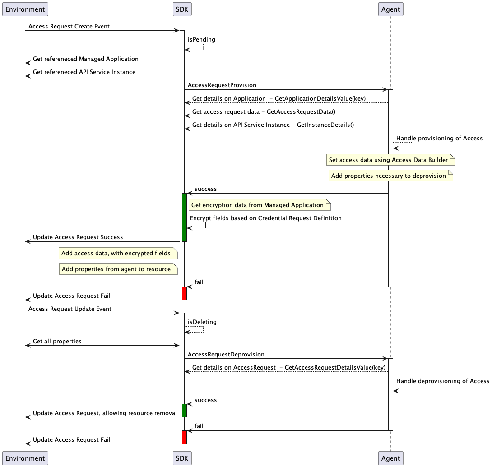

# Provisioning Setup and Processing

## Table of Contents

- [Provisioning Setup and Processing](#provisioning-setup-and-processing)
  - [Table of Contents](#table-of-contents)
  - [Provisioning Resources and Schemas](#provisioning-resources-and-schemas)
    - [Creating Access Request Schemas](#creating-access-request-schemas)
    - [Creating Credential Request Schemas](#creating-credential-request-schemas)
    - [Schema Builder](#schema-builder)
    - [Schema Property Builder](#schema-property-builder)
      - [String Property Builder](#string-property-builder)
      - [Number Property Builder](#number-property-builder)
      - [Integer Property Builder](#integer-property-builder)
      - [Array Property Builder](#array-property-builder)
  - [Handle Provisioning Requests](#handle-provisioning-requests)
    - [Creating and Registering Provisioner](#creating-and-registering-provisioner)
      - [RequestStatus return structure](#requeststatus-return-structure)
    - [Application Request Provision and Deprovision](#application-request-provision-and-deprovision)
    - [Access Request Provision and Deprovision](#access-request-provision-and-deprovision)
      - [Access Request Provisioning](#access-request-provisioning)
    - [Credential Request Provision and Deprovision](#credential-request-provision-and-deprovision)
      - [Credential Provisioning](#credential-provisioning)
      - [IDP Credential provisioning](#idp-credential-provisioning)
        - [IDP Registration](#idp-registration)
        - [Registering the Credential request definition for IDP](#registering-the-credential-request-definition-for-idp)
        - [IDP Credential provisioning/deprovisioning processing](#idp-credential-provisioningdeprovisioning-processing)

Marketplace Provisioning allows the consumer to create applications, associate products, and create credentials. Amplify Agents SDK watches for API server resources to trigger provisioning events for the agent to handle. The agents can configure data that is required from consumers to provision access or create credentials for the resource in the connected gateway.

## Provisioning Resources and Schemas

### Creating Access Request Schemas

An Access Request Definition tells Marketplace the information that a consumer may provide for granting access to a discovered API.

The Amplify Agent SDK provides a mechanism to set up access request definition schemas based on configuration parameters required by the connected gateway. The agent can set up schemas which register resources of type AccessRequestDefinition in Amplify Central. When the agent discovers an API and publishes it to Amplify Central, the created resource references one of the AccessRequestDefinition resources and associates it with the published API. This could be a schema per API on the target gateway or based on the authentication type of API.

The agent implementation can use the helper method `agent.NewAPIKeyAccessRequestBuilder().Register()` for an access request definition named *api-key* for API Key APIs that require no additional data for provisioning. It is also possible for the agent to create its own access request definitions by using `agent.NewAccessRequestBuilder()`, adding schema properties, see below, before calling Register.

Below is an example of using the builder to create a single Access Request Definition, named after an API. A single required property, Access Tier, with a list of accepted values. This could be called as part of the discovery process of an API, or at startup if its a single schema for many APIs.

```go
import (
    "github.com/Axway/agent-sdk/pkg/agent"
    "github.com/Axway/agent-sdk/pkg/apic/provisioning"
)

func createAccessRequestDefinition(apiName string, tiers []string) {
  agent.NewAccessRequestBuilder().
    SetName(apiName).
    AddProperty(provisioning.NewSchemaPropertyBuilder().
      SetName("tier").
      SetLabel("Access Tier").
      SetDescription("The Access Tier").
      SetRequired()).
      IsString().
        SetEnumValues(tiers).
        SetSortEnumValues()).
    Register()
}
```

Here are all of the methods allowed on the AccessRequestBuilder

```go
// AccessRequestBuilder - aids in creating a new access request
type AccessRequestBuilder interface {
  // Sets the name of the access request definition
  SetName(name string) AccessRequestBuilder
  // Sets the display name of the access request definition
  SetTitle(title string) AccessRequestBuilder
  // Sets the Request Schema, data provided by the requestor
  SetRequestSchema(schema SchemaBuilder) AccessRequestBuilder
  // Sets the Provision Schema, data provided to the requestor upon provisioning
  SetProvisionSchema(schema SchemaBuilder) AccessRequestBuilder
  // Helper to replicate the Request Schema into the Provision Schema
  SetProvisionSchemaToRequestSchema() AccessRequestBuilder
  // Builds the AccessRequestDefinition and sends it to API Central
  Register() (*management.AccessRequestDefinition, error)
}
```

### Creating Credential Request Schemas

A Credential Request Definition tells Marketplace the information that a consumer may provide for creating credentials required by a discovered API.

The Amplify Agent SDK provides a mechanism to set up credential request definition schemas based on configuration parameters required by the connected gateway. The agent can set up schemas which register resources of type CredentialRequestDefinition in Amplify Central. When the agent discovers an API and publishes it to Amplify Central, the created resource will then reference one or more of the CredentialRequestDefinition resources and associate them with the published API. Resulting in a list of all credential types that a particular API supports.

Along with the data needed to handle a provisioning request, the Credential Request Definition also contains a provisioning schema that defines the structure of the provisioned credential. For example an oauth credential will define a provisioning schema with a *client id* field and a *client secret* field that shall be encrypted.

The agent implementation provides a few helper methods for creating these Credential Requests Definitions, as described below.

```go
import (
    "github.com/Axway/agent-sdk/pkg/agent"
    "github.com/Axway/agent-sdk/pkg/apic/provisioning"
)

func createCredentialRequestDefinitions() {
  agent.NewAPIKeyCredentialRequestBuilder().Register() // API Key CRD builder with no additional settings 

  oAuthTypeProp := provisioning.NewSchemaPropertyBuilder(). // create a property for the Oauth credential type
    SetName("credType").
    SetRequired().
    SetDescription("Credential Type").
    IsString().
      SetEnumValues([]{"Public","Confidential"}) // add an enumeration

  agent.NewOAuthCredentialRequestBuilder(             // Oauth CRD builder helper, adds client id field
    agent.WithCRDType("OAuth"),                    // Credential type for Marketplace rendering (APIKey, Oauth, HTTPBasic, MutualTLS)
    agent.WithCRDOAuthSecret(),                       // its a secret based credential, add client secret field
    agent.WithCRDRequestSchemaProperty(oAuthTypeProp) // add a request schema property
    agent.WithIsRenewable(), // set that this credential type may be renewed
  ).Register() 
    
  agent.NewOAuthCredentialRequestBuilder(              // Oauth CRD builder helper, adds client id field
    agent.WithCRDType("OAuth"),                    // Credential type for Marketplace rendering (APIKey, Oauth, HTTPBasic, MutualTLS)
    agent.WithCRDOAuthPublicKey(),                     // its a key based credential, add public key request property
    agent.WithCRDRequestSchemaProperty(oAuthTypeProp), // add a request schema property
    agent.WithIsSuspendable(), // set that this credential type may be suspended
  ).Register()
}
```

Here are all of the methods allowed on the AccessRequestBuilder

```go
// CredentialRequestBuilder - aids in creating a new credential request
type CredentialRequestBuilder interface {
  // Sets the name of the credential
  SetName(name string) CredentialRequestBuilder
  // Sets the display name of this credential in the UI
  SetTitle(title string) CredentialRequestBuilder
  // Sets the Request Schema, data supplied by the requestor
  SetRequestSchema(schema SchemaBuilder) CredentialRequestBuilder
  // Sets the Provision Schema, data provided to the requestor upon provisioning
  SetProvisionSchema(schema SchemaBuilder) CredentialRequestBuilder
  // Sets a list of webhook names, separately created in Central, that are called on Credential state transitions
  SetWebhooks(webhooks []string) CredentialRequestBuilder
  // Adds a webhook name, separately created in Central, that is called on Credential state transitions
  AddWebhook(webhook string) CredentialRequestBuilder
  // Add additional details about this credential request definition on the resource
  AddXAgentDetails(key string, value interface{}) CredentialRequestBuilder
  // sets that this credential type may be renewed
  IsRenewable() CredentialRequestBuilder
  // sets that this credential type may be suspended
  IsSuspendable() CredentialRequestBuilder
  // set the default time to live, in days, for this credential type
  SetExpirationDays(days int) CredentialRequestBuilder
  // set that the credential will be deprovisioned on expiration
  SetDeprovisionExpired() CredentialRequestBuilder
  // Builds the CredentialRequestDefinition and sends it to API Central
  Register() (*management.CredentialRequestDefinition, error)
}
```

### Schema Builder

The schema builder has the following methods that may be used.

```go
type SchemaBuilder interface {
  // Set a name for the schema, this is required
  SetName(name string) SchemaBuilder
  // Set a description for the schema
  SetDescription(name string) SchemaBuilder
  // Add a property, via the SchemaPropertyBuilder, to the schema, call this as many times as needed
  AddProperty(property SchemaPropertyBuilder) SchemaBuilder
  // Set the property order
  SetPropertyOrder(propertyOrder []string) SchemaBuilder
  // Add a unique key to the schema, call this as many times as needed
  AddUniqueKey(keyName string) SchemaBuilder
  // Builds the schema to be used, returns the json schema in a map[string]interface
  Build() (map[string]interface{}, error)
}
```

### Schema Property Builder

The schema property builder has the following methods that may be used. Once a type is selected, IsString(), IsInteger(), IsNumber(), IsObject(), IsArray(), additional type specific methods are available.

```go
type TypePropertyBuilder interface {
  // SetName - sets the name of the property
  SetName(name string) SubscriptionPropertyBuilder
  // SetLabel - sets the label for the property for UI display
  SetLabel(label string) TypePropertyBuilder
  // SetDescription - set the description of the property
  SetDescription(description string) SubscriptionPropertyBuilder
  // SetRequired - set the property as a required field in the schema
  SetRequired() SubscriptionPropertyBuilder
  // SetReadOnly - set the property as a read only property
  SetReadOnly() SubscriptionPropertyBuilder
  // SetHidden - set the property as a hidden property
  SetHidden() SubscriptionPropertyBuilder
  // IsString - Set the property to be of type string, only strings may be encrypted
  IsString() StringPropertyBuilder
  // IsInteger - Set the property to be of type integer
  IsInteger() IntegerPropertyBuilder
  // IsNumber - Set the property to be of type number
  IsNumber() NumberPropertyBuilder
  // IsArray - Set the property to be of type array
  IsArray() ArrayPropertyBuilder
}
```

#### String Property Builder

```go
type StringPropertyBuilder interface {
  // SetEnumValues - Set a list of valid values for the property
  SetEnumValues(values []string) StringPropertyBuilder
  // SetSortEnumValues - Sort the allowed values alphabetically in the schema
  SetSortEnumValues() StringPropertyBuilder
  // SetFirstEnumValue - Set the value that should appear first in the list
  SetFirstEnumValue(value string) StringPropertyBuilder
  // AddEnumValue - Add another value to the list of allowed values for the property, call as many times as necessary
  AddEnumValue(value string) StringPropertyBuilder
  // IsEncrypted - Set that this field must be encrypted at rest, used only in credential provisioning schema
  IsEncrypted() StringPropertyBuilder
  // SetDefaultValue - Define the initial value for the property
  SetDefaultValue(value string) StringPropertyBuilder
  // SetAsTextArea - Set value to be rendered as a textarea box within the UI
   SetAsTextArea() StringPropertyBuilder
}
```

Example of a required string property declaration.

```go
provisioning.NewSchemaPropertyBuilder().
 SetName("stringProperty").
 SetDescription("Description of the String property.").
 SetAsTextArea().
 SetRequired().
   IsString()
```

Example of a required choice property declaration

```go
provisioning.NewSchemaPropertyBuilder().
  SetName("stringList").
  SetDescription("Description of the String property.").
  SetRequired().
    IsString().
      SetEnumValues([]string{"Application 42","Application 1", "Application 24"}).
      SetFirstEnumValue("Create an app").
      SetSortEnumValues()
```

Example of a secret property for a credential request provisioning schema

```go
provisioning.NewSchemaPropertyBuilder().
  SetName("secretProperty").
  SetDescription("Description of the secret property.").
  SetRequired().
    IsString().
      IsEncrypted()
```

#### Number Property Builder

```go
type NumberPropertyBuilder interface {
  // SetMinValue - Set the minimum allowed property value
  SetMinValue(min float64) NumberPropertyBuilder
  // SetMaxValue - Set the maximum allowed property value
  SetMaxValue(min float64) NumberPropertyBuilder
  // SetDefaultValue - Define the initial value for the property
  SetDefaultValue(value float64) NumberPropertyBuilder
}
```

Example of a Number property with Min and Max values.

```go
provisioning.NewSchemaPropertyBuilder().
  SetName("Number property").
  SetDescription("Description of the Number property.").
  IsNumber().
    SetMinValue(3.14).
    SetMaxValue(100.5).
    SetDefaultValue(50.42)
```

#### Integer Property Builder

```go
type IntegerPropertyBuilder interface {
  // SetMinValue - Set the minimum allowed property value
  SetMinValue(min int64) IntegerPropertyBuilder
  // SetMaxValue - Set the maximum allowed property value
  SetMaxValue(min int64) IntegerPropertyBuilder
  // SetDefaultValue - Define the initial value for the property
  SetDefaultValue(value int64) IntegerPropertyBuilder
}
```

Same display as for number property except accepting only integer values

```go
provisioning.NewSchemaPropertyBuilder().
  SetName("Integer property").
  SetDescription("Description of the Integer property.").
  IsInteger().
    SetMinValue(10).
    SetMaxValue(42).
    SetDefaultValue(10)
```

#### Array Property Builder

Create an array of property.

```go
type ArrayPropertyBuilder interface {
  // AddItem - Add an item property in the array property
  AddItem(item PropertyBuilder) ArrayPropertyBuilder
  // SetMinItems - Set the minimum number of items in the array property
  SetMinItems(min uint) ArrayPropertyBuilder
  // SetMaxItems - Set the maximum number of items in the array property
  SetMaxItems(max uint) ArrayPropertyBuilder
}
```

Example of an array property allowing integer inputs with Min and Max constraints.

```go
provisioning.NewSchemaPropertyBuilder().
  SetName("Array property").
  SetDescription("Description of the Array property.").
  IsArray().
    AddItem(provisioning.NewSchemaPropertyBuilder().
      SetName("HTTP Code").
      IsInteger().
        SetMinValue(100).
        SetMaxValue(599))
```

## Handle Provisioning Requests

The Agents SDK provides a registration method for the agent to implement an interface that is called when certain provisioning events happen in Amplify Central. Once registered, the Agents SDK will watch for these events and trigger the appropriate method for the agent to handle that provisioning request.

### Creating and Registering Provisioner

This is the provisioning interface that the agent is expected to implement.

```go
// Provisioning - interface to be implemented by agents for access provisioning
type Provisioning interface {
  ApplicationRequestProvision(ApplicationRequest) RequestStatus
  ApplicationRequestDeprovision(ApplicationRequest) RequestStatus
  AccessRequestProvision(AccessRequest) (RequestStatus, AccessData)
  AccessRequestDeprovision(AccessRequest) RequestStatus
  CredentialProvision(CredentialRequest) (RequestStatus, Credential)
  CredentialDeprovision(CredentialRequest) RequestStatus
}
```

Once implemented, the agent may register the structure that implements it with the following call.

```go
import "github.com/Axway/agent-sdk/pkg/agent"

agent.RegisterProvisioner(provisioningImplementation)
```

#### RequestStatus return structure

All Provisioning request methods will expect a RequestStatus object to be returned after handing the request.  To create this object, the Agent SDK provides a builder with the following methods.

```go
// RequestStatusBuilder - builder to create new request Status
type RequestStatusBuilder interface {
  // SetMessage - set the request Status message
  SetMessage(message string) RequestStatusBuilder
  // RequestStatusBuilder - adds any existing status reasons so they are not lost
  SetCurrentStatusReasons([]v1.ResourceStatusReason) RequestStatusBuilder
  // SetProperties - set the properties of the RequestStatus
  SetProperties(map[string]string) RequestStatusBuilder
  // AddProperty - add a new property on the RequestStatus
  AddProperty(key string, value string) RequestStatusBuilder
  // Success - set the status as success
  Success() RequestStatus
  // Failed - set the status as failed
  Failed() RequestStatus
}
```

The properties that are added to the request status are persisted back to the corresponding resource and will be available for subsequent provisioning/deprovisioning requests for that resource.

Example of a successful provisioning request that adds one property to the status.

```go
return provisioning.NewRequestStatusBuilder().AddProperty("ApplicationID", "apiid").Success()
```

Example of a failed provisioning request that adds a failure message.

```go
return provisioning.NewRequestStatusBuilder().SetMessage("failed for reason x").Failed()
```

### Application Request Provision and Deprovision

The Application request flow begins with the creation of a ManagedApplication resource in the environment that the agent is managing. The agent SDK will receive an event that the resource was created, check that the resource is in a Pending state, before handing it off to the agent. Below is an event diagram to show the process taken.


Both provision and deprovision requests will receive an ApplicationRequest object that contains the following methods.

```go
// ApplicationRequest - interface for agents to use to get necessary application request details
type ApplicationRequest interface {
  // GetManagedApplicationName returns the name of the managed application on this request
  GetManagedApplicationName() string
  // GetApplicationDetailsValue returns a value found on the 'x-agent-details' sub resource of the ManagedApplication
  GetApplicationDetailsValue(key string) string
  // GetTeamName gets the owning team name for the managed application
  GetTeamName() string
  // GetID returns the ID of the resource for the request
  GetID() string
}
```

When receiving a provisioning request the agent creates, an Application (or similar object) on the data plane, that will be associated with APIs and/or Credentials. During this provisioning, the agent should gather any details necessary to handle deprovisioning and set it in the [RequestStatus](#requeststatus-return-structure).

### Access Request Provision and Deprovision

The Access request flow begins with the creation of an AccessRequest resource in the environment that the agent is managing. The agent SDK will receive an event that the resource was created, check that the resource is in a Pending state, and gather details about the linked ManagedApplication before handing it off to the agent. Below is an event diagram to show the process taken.[](accessrequest.png)



Both provision and deprovision requests will receive an AccessRequest object that contains the following methods.

```go
// AccessRequest - interface for agents to use to get necessary access request details
type AccessRequest interface {
  // GetApplicationDetailsValue returns a value found on the 'x-agent-details' sub resource of the ManagedApplications.
  GetApplicationDetailsValue(key string) string
  // GetApplicationName returns the name of the managed application for this credential
  GetApplicationName() string
  // GetID returns the ID of the resource for the request
  GetID() string
  // GetAccessRequestDetailsValue returns a value found on the 'x-agent-details' sub resource of the AccessRequest.
  GetAccessRequestDetailsValue(key string) string
  // GetAccessRequestData returns the map[string]interface{} of data from the request
  GetAccessRequestData() map[string]interface{}
  // GetAccessRequestProvisioningData returns the interface{} of data from the provisioning response
  GetAccessRequestProvisioningData() interface{}
  // GetInstanceDetails returns the 'x-agent-details' sub resource of the API Service Instance
  GetInstanceDetails() map[string]interface{}
  // GetQuota returns the quota from within the access request
  GetQuota() Quota
}

// Quota - interface for accessing an access requests quota
type Quota interface {
  // GetInterval returns the quota interval from within the access request
	GetInterval() QuotaInterval
	// GetIntervalString returns the string representation of the quota interval from within the access request
	GetIntervalString() string
	// GetLimit returns the quota limit from within the access request
	GetLimit() int64
	// GetPlanName returns the product plan name from within the access request
	GetPlanName() string
}
```

`GetAccessRequestData()` will have the data requested from the Consumer while creating the request.  This data will match the Access Request Definition schema.

`GetAccessRequestProvisioningData()` will have the access data returned by the agent then the AccessRequestProvision method was called.


#### Access Request Provisioning

The following method needs to be implemented and will be invoked when a new AccessRequest resource is created in the environment the agent is linked to.

```go
  AccessRequestProvision(AccessRequest) (RequestStatus, AccessData)
```

The provision handling expects a response with 2 values, the [RequestStatus](#requeststatus-return-structure) and the AccessData. To create this AccessData object, the Agent SDK providers a builder with the following methods.


```go
// AccessDataBuilder - builder to create new access data to send to Central
type AccessDataBuilder interface {
  // Create AccessData that has an unknown data structure
  SetData(data map[string]interface{}) AccessData
}
```

If the AccessRequestDefinition that is being used by this agent does not have or need a Provisioning Schema for the Access Request then the agent implementation can simply return nil as the AccessData

### Credential Request Provision and Deprovision


Both provision and deprovision requests will receive an CredentialRequest object that contains the following methods.

```go
// CredentialRequest - interface for agents to use to get necessary credential request details
type CredentialRequest interface {
  // GetApplicationDetailsValue returns a value found on the 'x-agent-details' sub resource of the ManagedApplication.
  GetApplicationDetailsValue(key string) string
  // GetApplicationName returns the name of the managed application for this credential
  GetApplicationName() string
  // GetID returns the ID of the resource for the request
  GetID() string
  // GetName returns the name of the resource for the request
  GetName() string
  // GetCredentialDetailsValue returns a value found on the 'x-agent-details' sub resource of the Credential
  GetCredentialDetailsValue(key string) string
  // GetCredentialType returns the type of credential related to this request
  GetCredentialType() string
  // GetCredentialData returns the map[string]interface{} of data from the request
  GetCredentialData() map[string]interface{}
  // IsIDPCredential returns boolean indicating if the credential request is for IDP provider
  IsIDPCredential() bool
  // GetIDPProvider returns the interface for IDP provider if the credential request is for IDP provider
  GetIDPProvider() o.Provider
  // GetIDPCredentialData() returns the credential data for IDP from the request
  GetIDPCredentialData() IDPCredentialData
  // GetCredentialAction returns the action to be handled for this credential
  GetCredentialAction() CredentialAction
  // GetCredentialExpirationDays returns the number of days this credential has to live
  GetCredentialExpirationDays() int
}
```

`GetCredentialData()` will have the data requested from the Consumer while creating the request.  This data will match the Credential Request Definition request schema

#### Credential Provisioning

The following method needs to be implemented and will be invoked when a new Credential resource is created in the environment the agent is linked to.

```go
  CredentialProvision(CredentialRequest) (RequestStatus, Credential)
```

The provision handling expects a response with 2 values, the [RequestStatus](#requeststatus-return-structure) and the Credential. To create this Credential object, the Agent SDK providers a builder with the following methods.


```go
// CredentialBuilder - builder to create new credentials to send to Central
type CredentialBuilder interface {
  // Sets the expiration time for this credential, returns the builder
  SetExpirationTime(expTime time.Time) CredentialBuilder
  // Create a Credential that only sets an OAuth Client ID value
  SetOAuthID(id string) Credential
  // Create a Credential that sets an OAuth Client ID and Secret value
  SetOAuthIDAndSecret(id, secret string) Credential
  // Create a Credential that only sets an API Key value
  SetAPIKey(key string) Credential
  // Create a Credential that has a unknown data structure
  SetCredential(data map[string]interface{}) Credential
}
```

All of the builder methods above return the Credential object. The Agent SDK is able to assist in building the credential objects for OAuth and API Key authentication, if the agent needs to supply data that is not one of those known structures the SetCredential method should be used


#### IDP Credential provisioning


The Agent SDK maintains a registry for the managing the OAuth identity providers and exposes interface to register & lookups for the provider.

```go
// ProviderRegistry - interface for provider registry
type ProviderRegistry interface {
	// RegisterProvider - registers the provider using the config
	RegisterProvider(idp corecfg.IDPConfig, tlsCfg corecfg.TLSConfig, proxyURL string, clientTimeout time.Duration) error
	// GetProviderByName - returns the provider from registry based on the name
	GetProviderByName(name string) (Provider, error)
	// GetProviderByIssuer - returns the provider from registry based on the IDP issuer
	GetProviderByIssuer(issuer string) (Provider, error)
	// GetProviderByTokenEndpoint - returns the provider from registry based on the IDP token endpoint
	GetProviderByTokenEndpoint(tokenEndpoint string) (Provider, error)
	// GetProviderByAuthorizationEndpoint - returns the provider from registry based on the IDP authorization endpoint
	GetProviderByAuthorizationEndpoint(authEndpoint string) (Provider, error)
}
```

##### IDP Registration
The Agent SDK uses the following interface for configuration to register the OAuth providers
```go
// IDPAuthConfig - interface for IdP provider auth config
type IDPAuthConfig interface {
  // GetType - type of authentication mechanism to use "accessToken" or "client"
  GetType() string
  // GetAccessToken - token(initial access token/Admin API Token etc) to be used by Agent SDK to authenticate with IdP
  GetAccessToken() string
  // GetClientID - Identifier of the client in IdP that can used to create new OAuth clients
  GetClientID() string
  // GetClientSecret - Secret for the client in IdP that can used to create new OAuth clients
  GetClientSecret() string
}

// IDPConfig - interface for IdP provider config
type IDPConfig interface {
  // GetMetadataURL - URL exposed by OAuth authorization server to provide metadata information
  GetMetadataURL() string
  // GetIDPType - IDP type ("generic" or "okta")
  GetIDPType() string
  // GetIDPName - for the identity provider
  GetIDPName() string
  // GetAuthConfig - to be used for authentication with IDP
  GetAuthConfig() IDPAuthConfig
  // GetClientScopes - default list of scopes that are included in the client metadata request to IDP
  GetClientScopes() string
  // GetGrantType - default grant type to be used when creating the client. (default :  "client_credentials")
  GetGrantType() string
  // GetAuthMethod - default token endpoint authentication method(default : "client_secret_basic")
  GetAuthMethod() string
  // GetAuthResponseType - default token response type to be used when registering the client
  GetAuthResponseType() string
  // GetExtraProperties - set of additional properties to be applied when registering the client
  GetExtraProperties() map[string]string
}
```

The Amplify Agent SDK provides support for implicitly registering multiple identity providers based on environment variable based configuration. The environment variable based config need to be suffixed with the index number. The following is an example of registering the provider using environment variable based configuration.

```
AGENTFEATURES_IDP_NAME_#="local-keycloak"
AGENTFEATURES_IDP_TYPE_1="keycloak"
AGENTFEATURES_IDP_METADATAURL_1="http://keycloak:9999/realms/somerealm/.well-known/openid-configuration"
AGENTFEATURES_IDP_AUTH_TYPE_1="client"
AGENTFEATURES_IDP_AUTH_CLIENTID_1="service-account"
AGENTFEATURES_IDP_AUTH_CLIENTSECRET_1="service-account-secret"
AGENTFEATURES_IDP_SCOPE_1="resource.READ resource.WRITE"
```

###### Okta provider: `extraProperties` example
To enrich Okta provisioning (group assignment, policy/rule and scopes automation), set `extraProperties` for the Okta IDP. Example (as environment entry for the corresponding `AGENTFEATURES` index):

```
AGENTFEATURES_IDP_EXTRA_PROPERTIES_1='{
  "GroupName": "MyAppUsers",
  "createPolicy": true,
  "authServerId": "0oa-abc123",
  "policyTemplate": {
    "name": "Allow MyApp",
    "description": "Policy for MyApp",
    "rule": {
      "name": "Allow rule",
      "conditions": {"network": {"connection": "ANY"}},
      "actions": {"token": {"accessTokenLifetime": 3600}}
    }
  },
  "createScopes": true,
  "scopes": [
    {"name": "myapp.read", "description": "Read access"},
    {"name": "myapp.write", "description": "Write access"}
  ]
}'
```

Alternatively when registering the provider programmatically via `IDPConfiguration`, include the same keys under `ExtraProperties` (map[string]interface{}).

Notes:
- The provider accepts `group`, `Group`, `GroupName` and `groupName` keys for the group assignment.
- `createPolicy` defaults to `true` for Okta when not present; set it to `false` to skip automatic policy/rule creation.
- `policyTemplate` must be a map describing the policy and optionally include a `rule` object.


Alternatively, the agent implementation can choose to explicitly register the provider calling by using the `ProviderRegistry` interface.

```go
idpCfg := &config.IDPConfiguration{
    Name:            name,
    Type:            providerType,
    ExtraProperties: extraProperties,
    MetadataURL:     metadataURL,
    AuthConfig: &config.IDPAuthConfiguration{
        Type:         authType,
        ClientID:     clientID,
        ClientSecret: clientSecret,
        AccessToken:  accessToken,
    },
}
agent.GetAuthProviderRegistry().RegisterProvider(idpCfg, tlsCfg, proxyURL, clientTimeout)
```

##### Registering the Credential request definition for IDP
The Amplify Agent SDK provides a mechanism to set up credential request definition schemas using registered provider. The Amplify Agent SDK sets up the `CredentialRequestDefinition` resource with request schema for the data needed to provision the OAuth client with the specified provider.

```go
import (
    "github.com/Axway/agent-sdk/pkg/agent"
)

func registerCRDForOAuthProvider(crdName string, tokenURL, apiScopes string) error {
  p, err := agent.GetAuthProviderRegistry().GetProviderByTokenEndpoint(tokenURL)
  if err != nil {
    return fmt.Errorf("no provider registered for %s", tokenURL)
  }

  agent.NewOAuthCredentialRequestBuilder(
    agent.WithCRDType("OAuth"),  
    agent.WithCRDForIDP(p, scopes),
    agent.WithCRDName(crdName),
  ).Register()

  return nil
}
```

##### IDP Credential provisioning/deprovisioning processing

When receiving a provisioning/deprovisioning request the Amplify Agent SDK performs check to identify if the request is for IDP using the credential request data. For the IDP credential request, the Amplify SDK performs the lookup to identify the registered provider and prepares the data required to process the registration/un-registration using the credential request data.

For provisioning, the Amplify Agent SDK prepares the OAuth client metadata using the credential request data and uses the provider to register the client with IDP before calling the `CredentialProvision` handler

For deprovisioning, the Amplify Agent SDK calls the `CredentialDeprovision` handler and then uses the provider to unregister the client from IDP.

Both provision and deprovision handler will receive the `CredentialRequest` object that holds data for provisioned OAuth client in IDP. The Amplify Agent SDK exposes `IDPCredentialData` interface, that agent implementation can use to get the details(client id, client secret, grant type etc) of the provisioned OAuth IDP client and associate the information with dataplane.

```go
// IDPCredentialData - interface for the IDP credential request
type IDPCredentialData interface {
	// GetClientID - returns client ID
	GetClientID() string
	// GetClientSecret - returns client secret
	GetClientSecret() string
	// GetScopes - returns client scopes
	GetScopes() []string
	// GetGrantTypes - returns grant types
	GetGrantTypes() []string
	// GetTokenEndpointAuthMethod - returns token auth method
	GetTokenEndpointAuthMethod() string
	// GetResponseTypes - returns token response type
	GetResponseTypes() []string
	// GetRedirectURIs - Returns redirect urls
	GetRedirectURIs() []string
	// GetJwksURI - returns JWKS uri
	GetJwksURI() string
	// GetPublicKey - returns the public key
	GetPublicKey() string
}
```

The following is an example of the `CredentialProvision` handler implementation demonstrating the use if `IDPCredentialData` interface.

```go
func CredentialProvision(credentialRequest provisioning.CredentialRequest) (status provisioning.RequestStatus, credentials provisioning.Credential) {
  ...
  if credentialRequest.IsIDPCredential() {
    externalClientID := credentialRequest.GetIDPCredentialData().GetClientID()
    externalClientSecret := credentialRequest.GetIDPCredentialData().GetClientSecret()
    ...
    // Associate OAuth IDP client ID with dataplane
    ...
  }
  ...
}
```