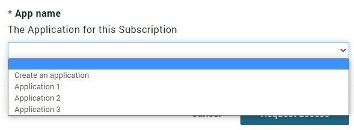

# Subscription Setup and Processing

Amplify Central Subscriptions allow the consumer to subscribe, using Amplify Unified Catalog, in order to gain access for the published asset. Amplify Agents SDK publishes API server resources which result in catalog items within Amplify Unified Catalog. The agents can configure metadata that is required from consumers, at the time of subscription, to provision access to the resource in the connected gateway.

## Table of Contents

- [Creating Subscription Schemas](#Creating-Subscription-Schemas)
- [Processing Subscriptions](#Processing-Subscriptions)

## Creating Subscription Schemas

The Amplify Agent SDK provides a mechanism to set up subscription schemas based on configuration parameters set up by discovery agent for the target API gateway. The agent can set up subscription schemas which register resources of type ConsumerSubscriptionDefinition an Amplify Central. When the agent discovers an API and publishes it to Amplify Central, the created resource references one of the ConsumerSubscriptionDefinition resources and associates it with the published API. This could be a schema per API on the target gateway or based on the authentication type of API.

The agent implementation can use the *SubscriptionSchemaBuilder* and *SubscriptionPropertyBuilder* interfaces to create a subscription schema with all properties needed and by calling the *Register()* method on *SubscriptionSchemaBuilder* the SDK creates the SubscriptionDefinition. The subscription schema definition can then later be used while publishing the API to associate the subscription schema with the published API server resource.

Below is an example of using the builders to create a single schema named after the Environment. The example only adds a single property, Application Name, and sets it as a required string, with an accompanying description. This could be called after the agent initialization.

```go
func createSubscriptionSchema() error {
 return apic.NewSubscriptionSchemaBuilder(a.apicClient).
    SetName(config.GetConfig().CentralConfig.GetEnvironmentName()).
    AddProperty(apic.NewSubscriptionSchemaPropertyBuilder().
      SetName("appName").
      IsString().
      SetEnumValues([]string{"Application 1", "Application 2", "Application 3"}).
      AddEnumValue("Create an application").
      SetFirstEnumValue("Create an application").
      SetSortEnumValues().
      SetDescription("The Application for this Subscription").
      SetRequired()).
    Register()
}
```

Creating the schema above will result in the Subscription dialog looking like the following.


With the application name drop down looking like this.



### Subscription Schema Builder

The subscription schema builder has the following methods that may be used.

```go
type SubscriptionSchemaBuilder interface {
  // Set a name for the subscription schema, this is required
  SetName(name string) SubscriptionSchemaBuilder

  // Add a property, via the SubscriptionPropertyBuilder, to the schema, call this as many times as needed
  AddProperty(property SubscriptionPropertyBuilder) SubscriptionSchemaBuilder

  // Add a unique key to the schema, call this as many times as needed
  AddUniqueKey(keyName string) SubscriptionSchemaBuilder

  // Allows a way to fail on a Register call if the schema name conflicts with an existing one, default is to allow an update
  Update(update bool) SubscriptionSchemaBuilder

  // Registers the schema with Amplify Central
  Register() error
}
```

### Subscription Schema Property Builder

The subscription schema property builder has the following methods that may be used.

```go
type SubscriptionPropertyBuilder interface {
  // Set a name for this property, this is required
  SetName(name string) SubscriptionPropertyBuilder

  // Set the property description
  SetDescription(description string) SubscriptionPropertyBuilder

  // Set the property as required in the schema
  SetRequired() SubscriptionPropertyBuilder

  // Set the property as read only in the schema
  SetReadOnly() SubscriptionPropertyBuilder

  // Set the property as hidden in the schema
  SetHidden() SubscriptionPropertyBuilder

  // Set the property to be of type string, this is the only supported type
  IsString() SubscriptionPropertyBuilder

  // Add a list of valid values for the property
  SetEnumValues(values []string) SubscriptionPropertyBuilder

  // Add another value to the list of allowed values for the property
  AddEnumValue(value string) SubscriptionPropertyBuilder

  // Sort the allowed values alphabetically in the schema
  SetSortEnumValues() SubscriptionPropertyBuilder

  // Set the value that should appear first in the list
  SetFirstEnumValue(value string) SubscriptionPropertyBuilder
  
  // Set the apic reference field for this property
  SetAPICRefField(field string) SubscriptionPropertyBuilder

  // Builds the property, this is called automatically by the schema builder
  Build() (*SubscriptionSchemaPropertyDefinition, error)
}
```

## Processing Subscriptions

The Amplify Central subscriptions follows the state transition to manage the subscription workflow. Below are the list of subscription states

| Subscription State    | Description                                                                                                                  |
|-----------------------|------------------------------------------------------------------------------------------------------------------------------|
| requested             | A transient state that indicates the user has submitted a subscription request and approval is required.                     |
| approved              | Indicates that the subscription request was approved by the asset provider and the access to the asset is being provisioned. |
| rejected              | Indicates that the subscription request was rejected by the asset provider.                                                  |
| active                | Indicates the provisioning is complete and consumer can use the asset. i.e make an API call for API assets.                  |
| failed_to_subscribe   | This state indicates there was an error during the provisioning.                                                             |
| unsubscribe_initiated | Indicates that the consumer has requested to unsubscribe from an asset.                                                      |
| unsubscribed          | De-provisioning the subscription is completed.                                                                               |
| failed_to_unsubscribe | This state indicates the request to unsubscribe could not be fulfilled due to an internal error.                             |
| change_requested      | Indicates that a change was submitted for a subscription. Change requests can be approved or rejected by asset providers.    |

To process the subscriptions, the Amplify Agents SDK provides a mechanism to register processors corresponding to subscription state. Typically the agent will register the processor for *approved* and *unsubscribe_initiated* to receive event for processing the provision or de-provision the subscription. The Amplify Agents SDK provides support for updating the subscription state to transition the subscription workflow to next state. For example, the processor for *approved* state can update the subscription state to *active* or *failed_to_subscribe* states.

The agent provides *apic.SubscriptionManager* interface that can be used for registering the callback function for validating the subscription and processing for specified state. The subscription manager manages calling the registered processor whenever there is a transition change in subscriptions on Amplify Central for the catalog items that were associated to discovered APIs. The subscription manager calls the registered validator before calling the registered callback for state processing. This allows the agent to perform any pre-validation before the callbacks are invoked. The processors are invoked onces the validator succeeds and the processor implementation can update the subscription state. When calling registered callbacks, the manager passes subscription object (*apic.Subscription* interface) as argument which provides methods to access the properties that are provided by the consumer for provisioning the subscription.

Below is the example of registering the subscription callbacks and sample processor/validator implementation

```go
func run() error {
 ...
 ...
 subscriptionManager := agent.GetCentralClient().GetSubscriptionManager()
 subscriptionManager.RegisterValidator(azClient.ValidateSubscription)
 subscriptionManager.RegisterProcessor(apic.SubscriptionApproved, azClient.ProcessSubscribe)
 subscriptionManager.RegisterProcessor(apic.SubscriptionUnsubscribeInitiated, azClient.ProcessUnsubscribe)
 ...

}


func (a *AzureClient) ValidateSubscription(subscription apic.Subscription) bool {
 // Add validation here if the processor callbacks needs to be called or ignored
 return true
}

func (a *AzureClient) ProcessSubscribe(subscription apic.Subscription) {
 allowTracing := subscription.GetPropertyValue("allowTracing")
 subscriptionID := subscription.GetID()
 ...
 ...
 // Process subscription provisioning here
 ...
 ...
 subscription.UpdateState(apic.SubscriptionActive)
}

func (a *AzureClient) ProcessSubscribe(subscription apic.Subscription) {
 subscriptionID := subscription.GetID()
 ...
 ...
 // Process subscription de-provisioning here
 ...
 ...
 subscription.UpdateState(apic.SubscriptionUnsubscribed)
}
```
